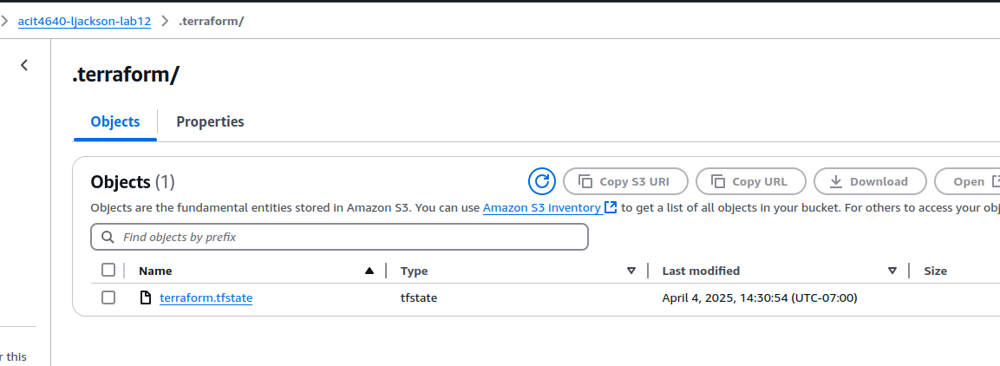
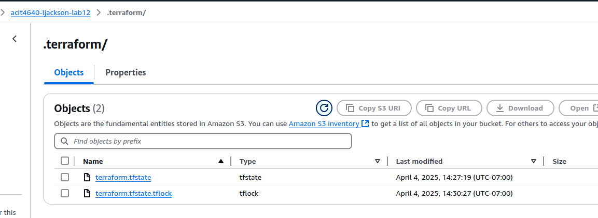

# 4640 Lab 12

- When is the state file created?

The state file is created during the first `terraform apply` operation (not during init or plan)

- When is the lock file present?

The lock file is present while a Terraform operation (like plan or apply) is actively running, and disappears after the operation completes.

- Is the lock file always in the bucket after it is created?

No, the lock file is temporary. It is only present during operations that modify the state and is automatically removed once the operation completes.

